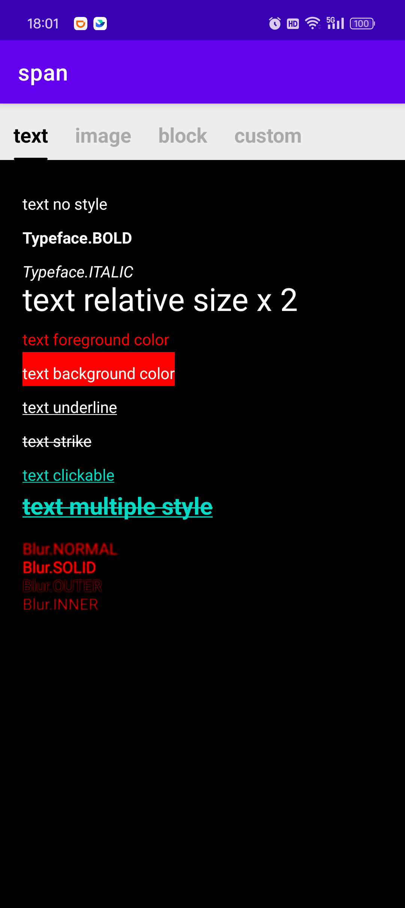
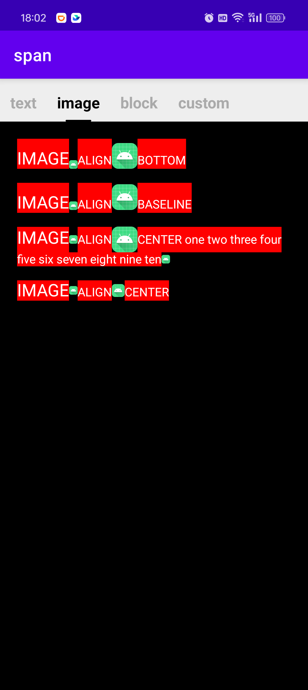
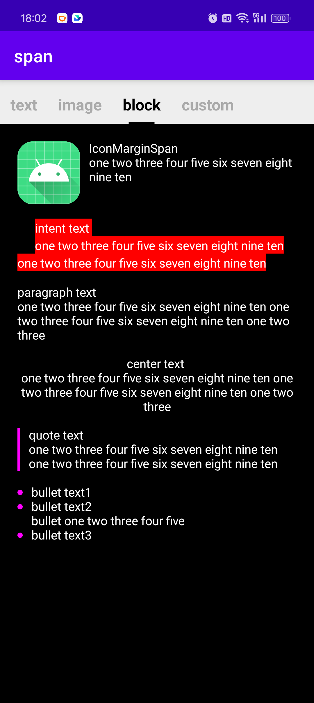
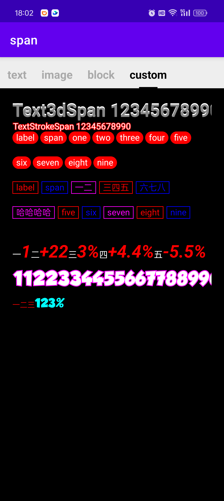

# span

基于 `buildSpannedString` 扩展的 `DSL`，可方便的构建 `Spanned`，扩展支持了块级样式，文字描边，文字3D风格，标签风格...

- 添加行内内容
  - **换行** `br()`
  - **图片** `image(drawable，width, height, align)` 
  - **图片** `image(context, resourceId，width, height, align)`
  - **文本** `text(text, spans)` 
  - **文本** `text(text, scale, color，size, typeface, style, bgColor)`  
- 添加块级内容
  - **块** `block(spans) { ... }`
  - **段落** `paragraph(align, lineHeight, intentFirst, intentRest) { ... }`
  - **引述** `quote(color) { ... }`
  - **列表项** `bullet(color) { ... }`
- 提供多种兼容性样式，抹平版本差异
  - `BulletCompatSpan`， API 28 开始 `BulletSpan` 才支持设置圆点尺寸
  - `QuoteCompatSpan`， API 29 开始 `QuoteSpan` 才支持设置指示条宽度和间隔
  - `TypefaceCompatSpan`， API 28 开始 `TypefaceSpan` 才支持传入 `Typeface`
  - `LineHeightCompatSpan`， API 29 开始才支持 `LineHeightSpan.Standard`
  - `ImageCompatSpan`， API 29 开始才支持 `ImageSpan.ALIGN_CENTER`，且图片高度 > 文本高度时，图片居中失效
- 提供多种自定义样式
  - `LabelSpan`，标签样式的文本
  - `Text3dSpan`，3D风格的文本
  - `TextStrokeSpan`，带描边的文本
  - `TextColorSpan`，解决 `ForegroundColorSpan` 与其它有些样式共用时会失效的问题
- 提供多种为文本快捷设置样式的方法
  - **为文本设置样式**  
    `CharSequence.setStyle(spans)`
  - **为文本中匹配正则表达式(regex)的部分设置样式**  
    `CharSequence.setStyle(regex) { arrayOf(spans) }`
  - **为文本中匹配正则表达式(regex)的部分设置样式**  
    `CharSequence.setStyle(regex, scale, color，size, typeface, style, bgColor)` 
  - **为文本中的数字设置样式**  
    `CharSequence.setNumberStyle(scale, color，size, typeface, style, bgColor)`
  - **为文本列表设置标签样式**  
    `List<String>.setLabelStyle(colors, height，corner, padding, spacing, stroke)`

 

   
<br> 



## Gradle

``` groovy
repositories {
    maven { url "https://gitee.com/ezy/repo/raw/cosmo/"}
}
dependencies {
    implementation "me.reezy.cosmo:span:0.10.0"
}
```
 
## 使用

```kotlin
buildSpannedString {
    paragraph(lineHeight = 30f.dp) {
        text("text no style")
        br()
        text("Typeface.BOLD", style = Typeface.BOLD)
        br()
        text("Typeface.ITALIC", style = Typeface.ITALIC)
        br()
        text("text relative size x 2", scale = 2f)
        br()
        text("text foreground color", color = Color.RED)
        br()
        text("text background color", bgColor = Color.RED)
        br()
        text("text underline", underline)
        br()
        text("text strike", strike)
        br() 
        clickable("text clickable") {
            Toast.makeText(requireContext(), "text clickable clicked", Toast.LENGTH_SHORT).show()
        }
        br()
        text("text multiple style", color(Color.RED), bold, underline, strike, scale(1.5f), clickable {
            Toast.makeText(requireContext(), "text multiple style clicked", Toast.LENGTH_SHORT).show()
        })
    }
    br() 
    paragraph { 
        text("IMAGE", size = 20f.dp, bgColor = Color.RED)
        image(requireContext(), R.mipmap.ic_launcher, 10f.dp, align = ImageSpan.ALIGN_CENTER)
        text("ALIGN", bgColor = Color.RED)
        image(requireContext(), R.mipmap.ic_launcher, 30f.dp, align = ImageSpan.ALIGN_CENTER)
        text("CENTER", bgColor = Color.RED)
        text(" one two three four five six seven eight nine ten", bgColor = Color.RED)
        image(requireContext(), R.mipmap.ic_launcher, 10f.dp, align = ImageSpan.ALIGN_CENTER)
    }
    br()
  
    paragraph(intentFirst = 20f.dp, lineHeight = 20f.dp) {
        inSpans(bgColor(Color.RED)) {
            append("intent text \none two three four five six seven eight nine ten one two three four five six seven eight nine ten")
        }
    }
  
    br()
  
    paragraph {
        append("paragraph text \none two three four five six seven eight nine ten one two three four five six seven eight nine ten one two three")
    }
  
    br()
  
    paragraph(Layout.Alignment.ALIGN_CENTER) {
        append("center text \none two three four five six seven eight nine ten one two three four five six seven eight nine ten one two three")
    }
  
    br()
  
    quote(Color.MAGENTA) {
        append("quote text \none two three four five six seven eight nine ten one two three four five six seven eight nine ten")
    }
  
    br()
  
    bullet(Color.MAGENTA) { append("bullet text1") }
    bullet(Color.MAGENTA) { append("bullet text2\nbullet one two three four five") }
    bullet(Color.MAGENTA) { append("bullet text3") }
} 
```


## LICENSE

The Component is open-sourced software licensed under the [Apache license](LICENSE).